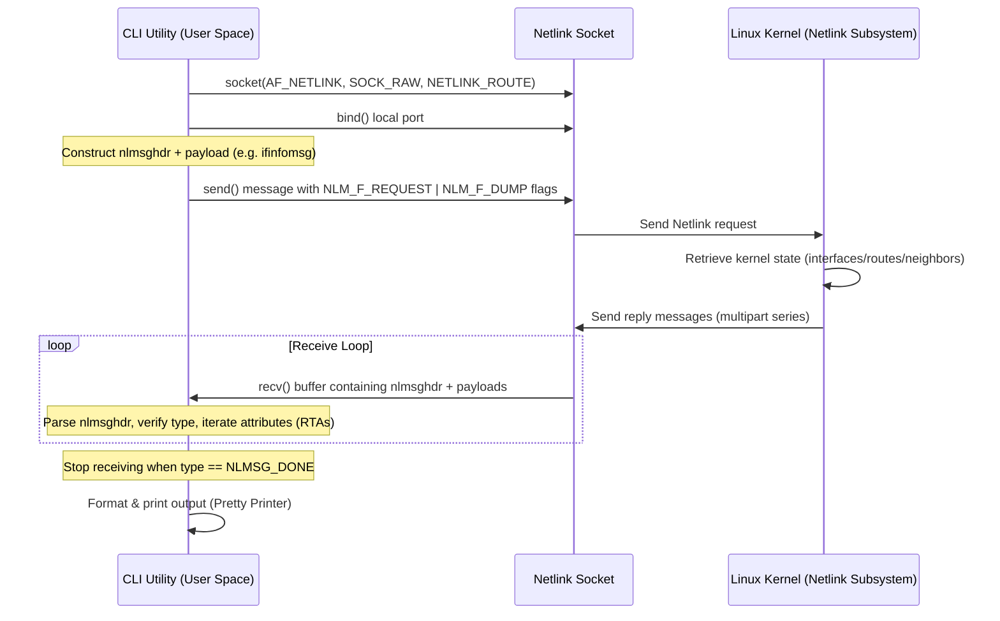

# Guide: Mini `ip` Utility using RTNETLINK

This guide outlines the architecture, directory structure, and step-by-step implementation flow for building a lightweight version of `ip addr`, `ip link`, and `ip route` directly utilizing **Netlink sockets (`NETLINK_ROUTE`)** and the **RTNETLINK** protocol in C.

---

## 1. Architectural Flow

The communication lifecycle between your CLI utility and the Linux Kernel occurs over a Netlink socket. Here is the lifecycle of a single query (e.g., retrieving interfaces):



---

## 2. Recommended Directory Structure

To keep your code modular, maintainable, and clean, structure the workspace as follows:

```
.
├── Makefile                # Build targets (default, clean, rebuild)
├── include/                # Header files for declarations
│   ├── netlink.h           # Socket creation, send, receive loop interface
│   ├── link.h              # Interfaces (link) parser & struct definitions
│   ├── addr.h              # IP address parser & struct definitions
│   ├── route.h             # Routing table parser & struct definitions
│   ├── neigh.h             # Neighbor (ARP) table parser & struct definitions
│   └── utils.h             # Utility helpers (MAC printing, flag representation, IP parsing)
├── src/                    # Source files for implementations
│   ├── main.c              # Command line argument parser (e.g. "./myip link show")
│   ├── netlink.c           # Low-level netlink socket functions
│   ├── link.c              # Link retrieval and parse logic
│   ├── addr.c              # Address retrieval and parse logic
│   ├── route.c             # Route retrieval and parse logic
│   ├── neigh.c             # Neighbor table retrieval and parse logic
│   └── utils.c             # Formatting functions
└── README.md               # Quick start documentation
```

---

## 3. The Netlink Request Blueprint

Every message sent to or received from the Netlink subsystem consists of:
1. **Netlink Message Header (`struct nlmsghdr`)**: Controls routing and metadata.
2. **Protocol Family Header**: Specific to the action (e.g., `struct ifinfomsg` for link queries).
3. **Optional Payload / Attributes**: Set parameters (for queries, these are usually empty or contain filtering options; when receiving, they hold the actual data).

### Structural Mapping of a Request

```
+--------------------------------------------------------+
|           Netlink Message Header (struct nlmsghdr)     |
| - nlmsg_len: Total size of message including payload  |
| - nlmsg_type: e.g., RTM_GETLINK / RTM_GETADDR          |
| - nlmsg_flags: NLM_F_REQUEST | NLM_F_DUMP              |
| - nlmsg_seq: Sequence number (for verification)       |
| - nlmsg_pid: Port ID (usually 0 for kernel)           |
+--------------------------------------------------------+
|           Protocol Family Header (e.g., struct rtgenmsg)|
| - rtgen_family: Address Family (AF_PACKET / AF_INET)   |
+--------------------------------------------------------+
```

---

## 4. Key Protocol Elements & Structs

For each command, you will request data with specific message types and parse them using their respective structures.

| Feature / Command | Request Type (`nlmsg_type`) | Family Header Structure | Attribute Loop Macro | Root Attributes (RTA) |
| :--- | :--- | :--- | :--- | :--- |
| **`ip link`** | `RTM_GETLINK` | `struct ifinfomsg` | `IFLA_RTA()` / `RTA_NEXT` | `IFLA_IFNAME`, `IFLA_ADDRESS`, `IFLA_MTU`, `IFLA_STATS` |
| **`ip addr`** | `RTM_GETADDR` | `struct ifaddrmsg` | `IFA_RTA()` / `RTA_NEXT` | `IFA_ADDRESS`, `IFA_LOCAL`, `IFA_LABEL` |
| **`ip route`** | `RTM_GETROUTE` | `struct rtmsg` | `RTM_RTA()` / `RTA_NEXT` | `RTA_DST`, `RTA_GATEWAY`, `RTA_OIF` |
| **`ip neigh`** | `RTM_GETNEIGH` | `struct ndmsg` | `NDA_RTA()` / `RTA_NEXT` | `NDA_DST`, `NDA_LLADDR` |

---

## 5. Coding Roadmap & Development Flow

To develop this project systematically, we recommend building and testing the core Netlink handling layer first, then building each sub-feature.

### Phase 1: The Core Netlink Transport Layer (`netlink.c` / `netlink.h`)
This handles the transport plumbing. You must:
1. **Open Socket**: Create `socket(AF_NETLINK, SOCK_RAW, NETLINK_ROUTE)`.
2. **Bind Socket**: Allocate a `struct sockaddr_nl local`, set `nl_family = AF_NETLINK`, `nl_pid = getpid()`, `nl_groups = 0`, and bind it.
3. **Send Command**: Write a generic send helper that wraps a request in `struct nlmsghdr` and uses `sendto()`.
4. **Receive Buffers**: Set up a robust receive loop because Netlink returns responses spanning multiple IP packets (multipart messages).
   - Use a large buffer (e.g., `8192` or `16384` bytes).
   - Read from socket in a loop using `recv()`.
   - Process multiple messages within a single `recv()` buffer using `NLMSG_OK` and `NLMSG_NEXT` macros.
   - Terminate the loop when `nlh->nlmsg_type == NLMSG_DONE` or `nlh->nlmsg_type == NLMSG_ERROR`.

### Phase 2: Interface Discovery (`link.c` / `link.h`) — Rebuilding `ip link`
Get the interfaces working first because other parts of the network stack (like addresses and routing) refer to interface indexes (`ifindex`).
1. **Construct Request**: Send `RTM_GETLINK` with a family header of `struct ifinfomsg` where `ifi_family = AF_UNSPEC`. Use flags `NLM_F_REQUEST | NLM_F_DUMP`.
2. **Parse Header**: When receiving, cast the message payload immediately after `struct nlmsghdr` to `struct ifinfomsg *`.
   - Read basic interface parameters: `ifi_index`, `ifi_flags` (e.g., `IFF_UP`, `IFF_LOOPBACK`), and `ifi_change`.
3. **Iterate Attributes**: Retrieve name, MAC, and MTU via the nested RTAs (Route Attributes):
   - Use `RTA_OK` and `RTA_NEXT` starting at the offset `IFLA_RTA(ifi_msg)`.
   - If attribute type is `IFLA_IFNAME`, read it as a string (interface name).
   - If `IFLA_ADDRESS`, format it as a MAC address (6 bytes).
   - If `IFLA_MTU`, parse it as a 32-bit unsigned integer.
   - If `IFLA_STATS` (or `IFLA_STATS64`), map it to `struct rtnl_link_stats` to extract RX/TX packets and bytes.

### Phase 3: IP Address Lookup (`addr.c` / `addr.h`) — Rebuilding `ip addr`
1. **Request**: Send `RTM_GETADDR` with `struct ifaddrmsg` payload, specifying `ifa_family = AF_INET` (IPv4) or `AF_UNSPEC` (both IPv4 and IPv6).
2. **Parse Header**: Cast received payloads to `struct ifaddrmsg *`. Extract `ifa_prefixlen` (CIDR mask, e.g., `/24`) and `ifa_index` (link interface).
3. **Iterate Attributes**: Use `IFA_RTA(ifa_msg)`.
   - Look for `IFA_LOCAL` or `IFA_ADDRESS`.
   - Use `inet_ntop()` to convert the address bytes to a human-readable IP string.
   - Match `ifa_index` back to the interface list to display which IP belongs to which interface.

### Phase 4: Route Inspection (`route.c` / `route.h`) — Rebuilding `ip route`
1. **Request**: Send `RTM_GETROUTE` with `struct rtmsg` payload.
2. **Parse Header**: Cast the response payload to `struct rtmsg *`.
3. **Iterate Attributes**: Use `RTM_RTA(rt_msg)`.
   - `RTA_DST`: The destination subnet. Convert it to IP string. Combined with `rtm_dst_len`, it forms your CIDR prefix (e.g., `192.168.1.0/24`). If no `RTA_DST` is present, it is the `default` route.
   - `RTA_GATEWAY`: Gateway address. Convert to string.
   - `RTA_OIF`: Outgoing interface index (integer). Map it to the interface name.

### Phase 5: ARP/Neighbor Table (`neigh.c` / `neigh.h`) — Rebuilding `ip neigh`
1. **Request**: Send `RTM_GETNEIGH` with `struct ndmsg` payload.
2. **Parse Header**: Cast to `struct ndmsg *`. Identify neighbor state via `ndm_state` (e.g., `NUD_REACHABLE`, `NUD_STALE`).
3. **Iterate Attributes**: Loop with `NDA_RTA(nd_msg)`.
   - `NDA_DST`: IP address of the neighbor.
   - `NDA_LLADDR`: MAC address of the neighbor.

---

## 6. Crucial Macro Tips & Gotchas

Working with raw Netlink requires parsing dynamic, offset-based arrays of elements. Ensure you understand and leverage these kernel macros:

1. **Walking the Netlink Messages in a Buffer**:
   ```c
   struct nlmsghdr *nlh;
   for (nlh = (struct nlmsghdr *)buffer; NLMSG_OK(nlh, len); nlh = NLMSG_NEXT(nlh, len)) {
       // Processes individual messages
   }
   ```
2. **Walking the Route Attributes (RTA) in a Message**:
   ```c
   struct rtattr *rta = IFLA_RTA(ifi_msg); // or IFA_RTA, etc.
   int rta_len = IFLA_PAYLOAD(nlh);        // or IFA_PAYLOAD, etc.
   for (; RTA_OK(rta, rta_len); rta = RTA_NEXT(rta, rta_len)) {
       switch(rta->rta_type) {
           case IFLA_IFNAME:
               // rta_data contains interface name string
               break;
       }
   }
   ```
3. **Size Calculations**:
   - `NLMSG_LENGTH(size)`: Calculates the size of a netlink message containing `size` bytes of payload.
   - `NLMSG_ALIGN(len)`: Aligns data structures to netlink boundary offsets.

---

## 7. Practical Tips for Iterative Implementation

1. **Mocking structure layouts**:
   Use standard header inclusions:
   ```c
   #include <sys/socket.h>
   #include <linux/rtnetlink.h>
   #include <arpa/inet.h>
   ```
2. **Handle buffers carefully**: Always zero out (`memset`) messages and structures before sending them, as the kernel will reject requests with non-zero undefined fields.
3. **Build a robust `ifindex` mapper**: Make a helper utility function that keeps a cache/list mapping index IDs (like `2`) to names (like `eth0`). You'll need this because IP addresses, routes, and neighbors all use `ifindex` instead of interface strings to identify interfaces.
